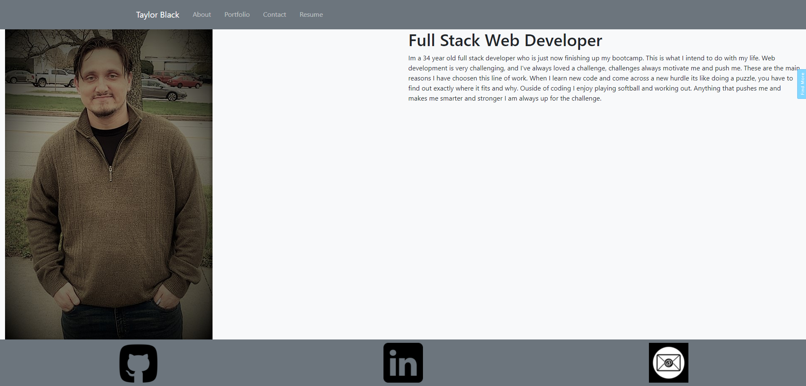

# React Portfolio
This is a portfolio using React. It includes tabs for my about section that will give you a brief description of who I am and what type of person I am. Then the contact tab will allow you to contact me. After that there is a portfolio page that will show you a few of the projects that I have done with a variety of the different codes that I am capable of using. Then there is the resume tab that has a generic resume template due to the fact that I dont really have a resume to speak of quite yet that is a work in progress.

[gitHub page](https://github.com/TWFB29/React_Portfolio)
[React Portfolio](https://twfb29.github.io/React_Portfolio/)